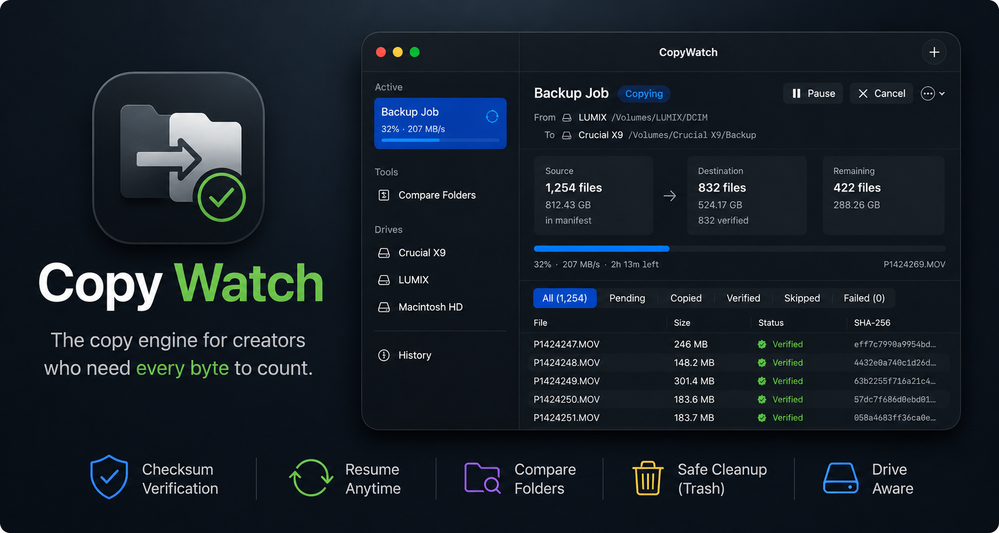

<p align="center">
  
</p>

# CopyWatch

**A free Mac app that copies your files and actually tells you whether it worked.**

If you've ever dragged a folder full of photos or video onto a hard drive and just *hoped* it all made it — CopyWatch is for you. It copies your files, double-checks every single one against the original, and keeps a permanent record so you never have to wonder again.

## Why this exists

Copying files in Finder is a black box. It shows you a progress bar, and then it's done — or it isn't, and you find out weeks later that half your wedding footage never made it to the backup drive. If the drive disconnects halfway through, or your Mac goes to sleep, or you accidentally quit the copy, Finder just... stops, and you're left guessing what actually transferred.

CopyWatch was built to remove the guesswork:

- It **checks every file it copies**, byte for byte, so a "successful" copy is actually verified — not just assumed.
- If something goes wrong partway through, it **remembers exactly where it stopped** and picks up from there — even if that's tomorrow, on a different Mac, after the drive got moved somewhere else.
- It keeps a **permanent history** of every backup you've ever run, so you can always look back and confirm what got copied, when, and whether it's still intact.

## Organize everything by project

Since version 2.0, CopyWatch revolves around **Projects** — because nobody thinks in "copy jobs." You think in *the client shoot*, *the Iceland trip*, *batch 12*.

- **Create a project once** — pick a folder template (Media Production, Photography, Event Coverage, Audio & Podcast, Client Work, Data & Research, or your own) and the drive(s) it lives on. CopyWatch creates the folder structure; you stay free to reorganize.
- **Insert a card, click Import** — CopyWatch recognizes camera, drone, GoPro, and audio-recorder cards by their on-disk structure (not their names) and offers to file each one into the right project folder, continuing the *Card 1, Card 2, Card 3…* series automatically.
- **See health at a glance** — every project shows **Protected** (everything verified), **Backing up…**, or **Needs attention** with the exact reason.
- **A permanent record per card** — when each card was imported, how many files, how big, verified or not, and whether the originals were cleared afterwards.
- **A full timeline** — every import, verification, and cleanup, day by day, for the life of the project.

The **Home** tab ties it together: a drop zone, whatever cards are connected right now (one click to import, one to browse), copies in progress, your recent projects, and saved destinations you can drop files straight onto.

## What it can do

- **Copy folders or individual files** to any drive, with a live progress view.
- **Verify** every file after copying, so silent corruption gets caught immediately instead of months later.
- **Resume interrupted copies** — stop today, plug the drive back in tomorrow, and it continues exactly where it left off (even mid-way through a single huge video file).
- **Rescue a copy Finder already messed up** — point CopyWatch at a destination that has a half-finished Finder copy sitting in it, and it'll figure out what's already there and finish the job properly.
- **Compare two folders** to see, at a glance, whether they truly match — same files, same sizes, nothing missing or corrupted.
- **Back up an iPhone or camera** — browse its photos and videos like a gallery and pick exactly what to copy.
- **Double-check itself, anytime** — hit "Recheck" on any past backup to confirm both the source and destination still match, even if it's been weeks. If a file went missing (even if it just got dragged to the Trash), CopyWatch will tell you and offer to fix it.
- **Free up space safely** — once a backup is fully verified, CopyWatch can move the original files to the Trash for you (never a permanent delete) so you can reuse the card or drive.
- **Back up to several drives at once** — one source, two or more verified copies in a single pass. Save a destination that holds multiple folders and every drop fans out to all of them.
- **Skip what's already there** — CopyWatch recognises files that are already backed up (by checksum, not just name and size) and skips them, so re-running a backup only copies what actually changed.
- **Get a shareable integrity certificate** — every finished backup produces a certificate with a unique ID and the full checksum manifest, so you can prove the copy is intact.
- **Export an industry-standard MHL** — a Media Hash List that other offload tools (Hedge, ShotPut Pro, Silverstack, Resolve) can verify your copy against.
- **Choose your checksum** — SHA-256 (cryptographic, powers the certificate) or xxHash64 (the media-industry standard, faster on very fast drives). Verification reads back from the drive itself, never from the memory cache, so a bad cable or failing drive is actually caught.
- **Keep file metadata intact** — Finder tags, permissions, and creation dates survive the copy (Finder's own copies lose the creation date).
- **Compare in Finder, instantly** — one click opens Finder's Get Info windows for the source and every destination side by side; file-selection jobs can do the same for the exact items you picked.
- **Benchmark your drives** — measure real read/write speed and health to diagnose a slow backup or catch a drive that's starting to fail.
- **Plain-language errors** — if something goes wrong, CopyWatch tells you what happened (drive disconnected, cable unstable, disk full, permission denied…) and how to fix it.
- **Never lose a transfer to a full drive** — if the destination runs out of space (or goes read-only) mid-copy, CopyWatch stops safely and keeps your progress. Free up space and **Try Again**, or **Change Destination** to finish the backup on a bigger drive — no starting over.
- **Repair a mismatched copy** — after comparing two folders, one click on **Repair** copies the missing and different files from the original into the copy, skipping everything already identical. It never deletes.

## Install it

**Easiest way — Homebrew:**

```sh
brew tap ishaanpilar/tap
brew install --cask copywatch
```

**Or download directly:** grab the latest `.dmg` from the [Releases page](https://github.com/ishaanpilar/CopyWatch/releases/latest), open it, and drag CopyWatch into your Applications folder.

> **First launch note:** CopyWatch isn't (yet) signed with an Apple Developer certificate, so macOS will warn you the first time you open it. Right-click the app and choose **Open**, then confirm — you'll only need to do this once.

## Using it

**The project way (recommended):**

1. Click **New Project**, name it, pick a template and the drive it lives on.
2. Insert a camera card. CopyWatch recognizes it and offers to import it into the right folder — confirm, and it copies and verifies.
3. Insert the next card. Repeat over as many days as the job takes. The project keeps everything organized with a full history.

**The quick way:**

Drag files anywhere into the window (or onto a saved destination on the Home tab), pick where they go, done. Or click **+ New Copy Job** — the file picker opens first, then you confirm the destination and start. Verify, checksum choice, and multi-drive copying live under **Options**.

Either way, when it's done you'll see a green **"Everything is good"** — every file made it and matches the original.

If a drive disconnects, or you quit the app, or your Mac restarts — just open CopyWatch again and hit **Resume**. Nothing is lost, and nothing gets copied twice.

Backing up an iPhone or camera works the same way: connect it, and it appears on the Home tab and under **Devices** in the sidebar — browse its media and pick what you want backed up.

## Frequently asked questions

**Do I need to know anything technical to use this?**
No. Everything above is the whole app — pick a source, pick a destination, click Start. The one exception is if you want to build it yourself from source, which is covered further down for the curious.

**Is this safe to use for something important, like footage I can't reshoot?**
That's exactly the situation it's built for. Every copy is verified against the original before CopyWatch calls it done, and nothing is ever deleted from your source files unless you explicitly ask it to (and even then, files go to the Trash, not straight to permanent deletion).

**What's the difference between this and just dragging files in Finder?**
Finder doesn't check its own work, doesn't tell you what specifically failed if something goes wrong, and can't resume an interrupted copy — you'd have to start over and hope you can tell what's already there. CopyWatch does all three.

**Does it cost anything?**
No — it's free and open source.

**Does it work with SD cards, external SSDs, USB drives?**
Yes, any drive that shows up on your Mac. iPhones and cameras are supported too, through a separate flow since they don't work like normal drives.

---

## For developers

The rest of this section is for people who want to build CopyWatch from source or contribute to it — not needed to just use the app.

### Build & run

```sh
./build.sh          # → dist/CopyWatch.app
open dist/CopyWatch.app
```

Requires macOS 14+ and Xcode command-line tools. No external dependencies — it's a plain SwiftPM executable target, no `.xcodeproj`.

### Headless mode (testing / scripting)

```sh
CopyWatch --headless copy <source> <destParent> [<destParent2> …] [--no-verify] [--xxhash]
CopyWatch --headless compare <a> <b> [--deep]
```

Headless jobs are saved to the same history the app shows.

### Code layout

- `Sources/CopyWatch/Engine/` — scanner, checksums (SHA-256 / xxHash64), reconciler, MHL export, certificates, and the copy engine (chunked pipelined copy, mid-file resume, cache-bypassed verify, parallel multi-destination writes).
- `Sources/CopyWatch/Models/` + `Store/` — project/job/manifest models, JSON persistence in `~/Library/Application Support/CopyWatch/`.
- `Sources/CopyWatch/System/` — volume watching, camera-card detection, Finder Get Info, eject, sleep/App Nap blocking, notifications, Trash search.
- `Sources/CopyWatch/Views/` — SwiftUI: Home, project dashboard & workspaces, job detail with comparison dashboard, compare tool, sheets, device gallery.

### Roadmap

- Passive Finder-activity logger (best-effort history of copies made outside CopyWatch).
- Code signing & notarization, to remove the Gatekeeper warning on first launch.
- Adding a drive to an existing project (with automatic backfill of earlier imports).

### Contributing

Issues and pull requests are welcome — see the [issue tracker](https://github.com/ishaanpilar/CopyWatch/issues).

---

<p align="center"><sub>Created by Ishaan Pilar</sub></p>
